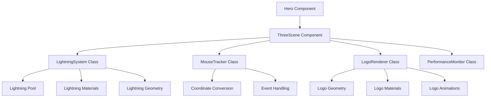

# Design Document

## Overview

Bu design document x.o.n-intractive-3d-logo papkasidagi interactive 3D logoni CloudPlay 2.0 dasturiga integratsiya qilish uchun texnik yechimni belgilaydi. Tashqi papkadagi original kodni tahlil qilib, uni hozirgi ThreeScene komponentiga moslash, mouse tracking va chaqmoq effektlari muammolarini hal qilish, performance ni optimize qilish va responsive design ni ta'minlash asosiy maqsadlar hisoblanadi.

## Architecture

### High-Level Architecture



### Component Hierarchy

1. **ThreeScene (Main Container)**
   - Scene initialization va management
   - Component lifecycle management
   - Event coordination
   - Cleanup handling

2. **LightningSystem (Lightning Management)**
   - Lightning pool management
   - Lightning path generation
   - Lightning animation
   - Material management

3. **MouseTracker (Mouse Tracking)**
   - Mouse event handling
   - Coordinate conversion
   - Position smoothing
   - Touch support

4. **LogoRenderer (Logo Rendering)**
   - Logo geometry creation
   - Material setup
   - Responsive scaling
   - Animation effects

## Components and Interfaces

### ThreeScene Interface

```typescript
interface ThreeSceneProps {
    className?: string;
    debugMode?: boolean;
    performanceMode?: 'high' | 'medium' | 'low';
}

interface ThreeSceneState {
    isLoading: boolean;
    mousePosition: THREE.Vector3;
    lightningActive: boolean;
    performanceStats: PerformanceStats;
}
```

### LightningSystem Interface

```typescript
interface LightningConfig {
    poolSize: number;
    maxBranches: number;
    strikeInterval: { min: number; max: number };
    hotZoneDistance: number;
    lightningDuration: { min: number; max: number };
}

interface LightningBolt {
    id: string;
    isActive: boolean;
    startTime: number;
    duration: number;
    path: LightningPath | null;
    meshes: LightningMeshSet;
    materials: LightningMaterials;
}

class LightningSystem {
    constructor(scene: THREE.Scene, config: LightningConfig);
    triggerLightning(start: THREE.Vector3, end: THREE.Vector3): void;
    update(deltaTime: number): void;
    setIntensity(intensity: number): void;
    dispose(): void;
}
```

### MouseTracker Interface

```typescript
interface MouseTrackerConfig {
    smoothing: number;
    sensitivity: number;
    touchSupport: boolean;
}

class MouseTracker {
    constructor(element: HTMLElement, camera: THREE.Camera, config: MouseTrackerConfig);
    getWorldPosition(): THREE.Vector3;
    getScreenPosition(): THREE.Vector2;
    setTarget(target: THREE.Object3D): void;
    dispose(): void;
}
```

### LogoRenderer Interface

```typescript
interface LogoConfig {
    size: number;
    material: 'chrome' | 'glass' | 'metal';
    animation: boolean;
    responsive: boolean;
}

class LogoRenderer {
    constructor(scene: THREE.Scene, config: LogoConfig);
    createLogo(): THREE.Group;
    updateScale(screenSize: { width: number; height: number }): void;
    animate(deltaTime: number): void;
    dispose(): void;
}
```

## Data Models

### Lightning Path Model

```typescript
interface LightningPath {
    main: THREE.Vector3[];
    branches: THREE.Vector3[][];
    totalLength: number;
    complexity: number;
}

interface LightningMeshSet {
    main: THREE.Mesh;
    glow: THREE.Mesh;
    branches: THREE.Mesh[];
    branchGlows: THREE.Mesh[];
}

interface LightningMaterials {
    core: THREE.MeshBasicMaterial;
    glow: THREE.MeshBasicMaterial;
    branch: THREE.MeshBasicMaterial;
    branchGlow: THREE.MeshBasicMaterial;
}
```

### Performance Model

```typescript
interface PerformanceStats {
    fps: number;
    memoryUsage: number;
    drawCalls: number;
    triangles: number;
    lightningCount: number;
}

interface PerformanceConfig {
    targetFPS: number;
    maxLightningBolts: number;
    qualityLevel: 'high' | 'medium' | 'low';
    adaptiveQuality: boolean;
}
```

## Error Handling

### Error Types

1. **Initialization Errors**
   - WebGL support check
   - Three.js library loading
   - Canvas creation failure

2. **Runtime Errors**
   - Geometry creation failure
   - Material compilation error
   - Animation frame errors

3. **Performance Errors**
   - Low FPS detection
   - Memory leak detection
   - GPU memory exhaustion

### Error Recovery Strategy

```typescript
class ErrorHandler {
    static handleWebGLError(error: Error): void;
    static handleGeometryError(error: Error): void;
    static handlePerformanceError(stats: PerformanceStats): void;
    static fallbackToSimpleMode(): void;
}
```

## Testing Strategy

### Unit Testing

1. **Component Testing**
   - ThreeScene component mounting/unmounting
   - Props validation
   - State management

2. **Class Testing**
   - LightningSystem functionality
   - MouseTracker coordinate conversion
   - LogoRenderer geometry creation

3. **Utility Testing**
   - Math utilities
   - Performance monitoring
   - Error handling

### Integration Testing

1. **Mouse Interaction Testing**
   - Mouse move events
   - Touch events
   - Coordinate conversion accuracy

2. **Lightning System Testing**
   - Lightning triggering
   - Animation smoothness
   - Performance impact

3. **Responsive Testing**
   - Different screen sizes
   - Orientation changes
   - Mobile devices

### Performance Testing

1. **FPS Monitoring**
   - Target 60 FPS on desktop
   - Target 30 FPS on mobile
   - Adaptive quality adjustment

2. **Memory Testing**
   - Memory leak detection
   - Garbage collection monitoring
   - Resource cleanup verification

3. **Load Testing**
   - Multiple lightning bolts
   - Extended usage periods
   - Resource exhaustion scenarios

## Implementation Phases

### Phase 1: Analyze External Code
- Locate and analyze x.o.n-intractive-3d-logo folder structure
- Extract working interactive logo implementation
- Identify key components and logic
- Document original functionality

### Phase 2: Code Integration Strategy
- Compare original implementation with current ThreeScene
- Identify differences in mouse tracking logic
- Extract working lightning system from original
- Plan integration approach

### Phase 3: Debug and Fix Current Issues
- Add comprehensive logging to current implementation
- Fix mouse tracking coordinate conversion using original logic
- Debug lightning visibility issues with original reference
- Implement error boundaries

### Phase 4: Refactor and Optimize
- Extract classes from monolithic component
- Implement object pooling based on original approach
- Optimize geometry creation/disposal
- Add performance monitoring

### Phase 5: Enhance and Polish
- Improve lightning visual effects using original as reference
- Maintain responsive scaling from current implementation
- Implement touch support
- Add configuration options

### Phase 6: Testing and Validation
- Cross-browser testing
- Mobile device testing
- Performance benchmarking
- User experience validation

## Configuration System

### Default Configuration

```typescript
const DEFAULT_CONFIG = {
    lightning: {
        poolSize: 5,
        maxBranches: 3,
        strikeInterval: { min: 0.1, max: 0.5 },
        hotZoneDistance: 1.5,
        lightningDuration: { min: 0.2, max: 0.3 }
    },
    mouse: {
        smoothing: 0.1,
        sensitivity: 1.0,
        touchSupport: true
    },
    logo: {
        size: 1.0,
        material: 'chrome',
        animation: true,
        responsive: true
    },
    performance: {
        targetFPS: 60,
        maxLightningBolts: 3,
        qualityLevel: 'high',
        adaptiveQuality: true
    }
};
```

## Responsive Design Strategy

### Breakpoints

- Mobile: < 768px
- Tablet: 768px - 1024px  
- Desktop: > 1024px

### Adaptive Features

1. **Logo Scaling**
   - Mobile: 0.7x scale
   - Tablet: 0.85x scale
   - Desktop: 1.0x scale

2. **Lightning Complexity**
   - Mobile: Reduced branches, simpler paths
   - Tablet: Medium complexity
   - Desktop: Full complexity

3. **Performance Adjustments**
   - Mobile: Lower quality materials, reduced effects
   - Tablet: Medium quality
   - Desktop: High quality

Bu design document interactive 3D logo integratsiyasining barcha texnik jihatlarini qamrab oladi va implementation uchun aniq yo'l-yo'riq beradi.
## Ex
ternal Code Integration Strategy

### Source Code Analysis

1. **Locate Original Implementation**
   - Find x.o.n-intractive-3d-logo folder outside CloudPlay 2.0
   - Analyze folder structure and main files
   - Identify entry points and core components
   - Document dependencies and libraries used

2. **Code Comparison**
   - Compare original mouse tracking implementation
   - Analyze lightning system differences
   - Identify performance optimizations in original
   - Document visual and logic differences

3. **Integration Approach**
   - Extract working components from original
   - Adapt to current project structure
   - Maintain existing responsive design improvements
   - Preserve current project's styling and layout

### Migration Strategy

1. **Selective Integration**
   - Copy only the working interactive logic
   - Adapt coordinate systems to current setup
   - Maintain current responsive positioning
   - Keep current material and lighting setup

2. **Incremental Testing**
   - Test mouse tracking first
   - Then integrate lightning system
   - Validate visual effects
   - Ensure performance is maintained

3. **Fallback Plan**
   - Keep current implementation as backup
   - Implement feature flags for easy rollback
   - Progressive enhancement approach
   - Gradual deployment strategy

Bu approach tashqi koddan faqat kerakli qismlarni olib, hozirgi loyihadagi yaxshilanishlarni saqlab qolishga imkon beradi.